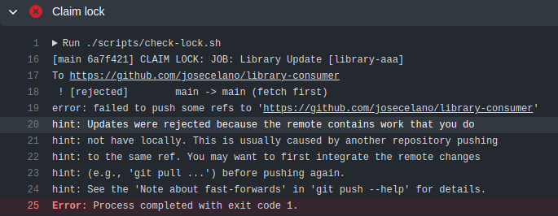

# Library Consumer

Proof of Concept based on this issue: <https://github.com/Nautilus-Cyberneering/chinese-ideographs-website/issues/19>

**Requirements**:

- We have a git repo containing only text files. We call it [library-aaa](https://github.com/josecelano/library-aaa).
- We want to mirror the content of that library into this repo in the folder `libraries_mirror/aaa`.
- We want to create a workflow as a cronjob that pulls the latest version of the library every 10 minutes and sync the changes.
- We can create only one commit to apply all changes.
- Source folder: <https://github.com/josecelano/library-aaa/tree/main/data>
- Folder mirror: [libraries_mirror/aaa](./libraries_mirror/aaa)

This solution has some potential concurrency problems. They can be solved by using the workflow attribute [concurrency](https://docs.github.com/en/actions/learn-github-actions/workflow-syntax-for-github-actions#concurrency)

**Alternative solution**:

We want to implement a different solution using a locking a git commit as a lock for the update. The rules are:

- Only one workflow can update the library. We need to enforce mutual exclusion for workflows updating the library.
- We want to use a [lock](https://en.wikipedia.org/wiki/Lock_(computer_science)) mechanism.
- When a thread (workflow) wants to update the library it has to claim the lock first and release it at the end of the process.
- "Claim the lock" means create an empty commit and push it into the `main` branch. If a second workflows tries to do the same it going to get a merge conflict because we only allow fast forward merge. The first workflow pushing to main will get the lock.
- Regardless of whether the workflows succeed or fail we have to release the lock at the end of the execution.

**Pros**:

- We do not need to rely on external service.

**Cons**:

- We force fast forward merges for all PRs.
- If we want to avoid too many merge conflicts we have to pause other manual PR merges when the workflow is being executed.
- We only can have one global lock at the time. Actually this solution provides a way to lock any other merge into the main branch.

**Potencial problems**:

- If someone pulls the lock commit and push a new commit to main before the workflows finishes, the the workflow will fail and it won't release the lock.
- You can not use these two commit message subject prefixes: `lock: claim` and `lock: release`.
- The solution is not valid for more than one lock. THe lock provides a mechanism to have exclusive access to merges into main.

## Error examples we are trying to solve with this solution

### Example 1: overwrite a newer version of the file

Note: a new workflow is executed every 10 minutes.

- `T1`. Add new file to the library (`1.txt`)
- `T2`. We run `W1` to update the library. For some reason this process takes more than 10 minutes.
- `T3`. We modify the file `1.txt` in the library.
- `T4`. (T2+10") We run a second workflow `W2` to update the library.
- `T5`. The workflow `W2` finishes and creates a commit with the second version of file `1.txt`.
- `T6`. The workflow `W1` finishes and overwrites the first version of the file `1.txt`.

## Testing

You can run workflows in parallel by triggering the workflow manually:


In order to import changes from the [library](https://github.com/josecelano/library-aaa), first you need to create or change a text file on the [library data folder](https://github.com/josecelano/library-aaa/tree/main/data).

When the workflow finishes the got log output should be something like:

```s
* cca716d - (HEAD -> main, origin/main) lock: release 1697675435 (2022-01-14 12:32:40 +0000) <github-actions[bot]>
* 0244a1d - library aaa synced to commit 56707c9aef100837857c4d6858435d97edcd8f19 (2022-01-14 12:32:39 +0000) <github-actions[bot]>
* 655358d - update library aaa to commit 56707c9aef100837857c4d6858435d97edcd8f19 (2022-01-14 12:32:39 +0000) <github-actions[bot]>
* 469ddf8 - lock: claim 1697675435 (2022-01-14 12:32:37 +0000) <github-actions[bot]>
```

The second workflow executed should fail:


With this message:



## Git commands

Pull changes including submodules.

```shell
git pull --recurse-submodules
```

## Specification

- Commit content must be empty.
- The first line of the commit message (subject) must follow a predefined format.
- The rest of the commit message (body) can contain a `json` object with more data.

### Commit messages subject

Claim lock:

```text
lock: claim [THREAD_ID]
```

`THREAD_ID` is a unique id for the process that is trying to have exclusive access.
We are using the run ID provided by GitHub.

Claim lock:

```text
lock: claim [RESOURCE ID]
```

### Commit messages body

This could be a sample "lock claim" commit message body:

```json
{
    "payload": {
        "previous_ref": "319eb98f037ebc9d9e8f18c208d0a40f5bedd6b2",
        "current_ref": "319eb98f037ebc9d9e8f18c208d0a40f5bedd6b2"
    },
    "metadata": {
        "run_id": 4816034715,
        "run_number": 1
    }
}
```

This could be a sample "lock release" commit message body:

```json
{
    "payload": {
        "previous_ref": "319eb98f037ebc9d9e8f18c208d0a40f5bedd6b2",
        "current_ref": "319eb98f037ebc9d9e8f18c208d0a40f5bedd6b2"
    },
    "metadata": {
        "run_id": 4816034715,
        "run_number": 1
    }
}
```

## TODO

- Commit message body.
